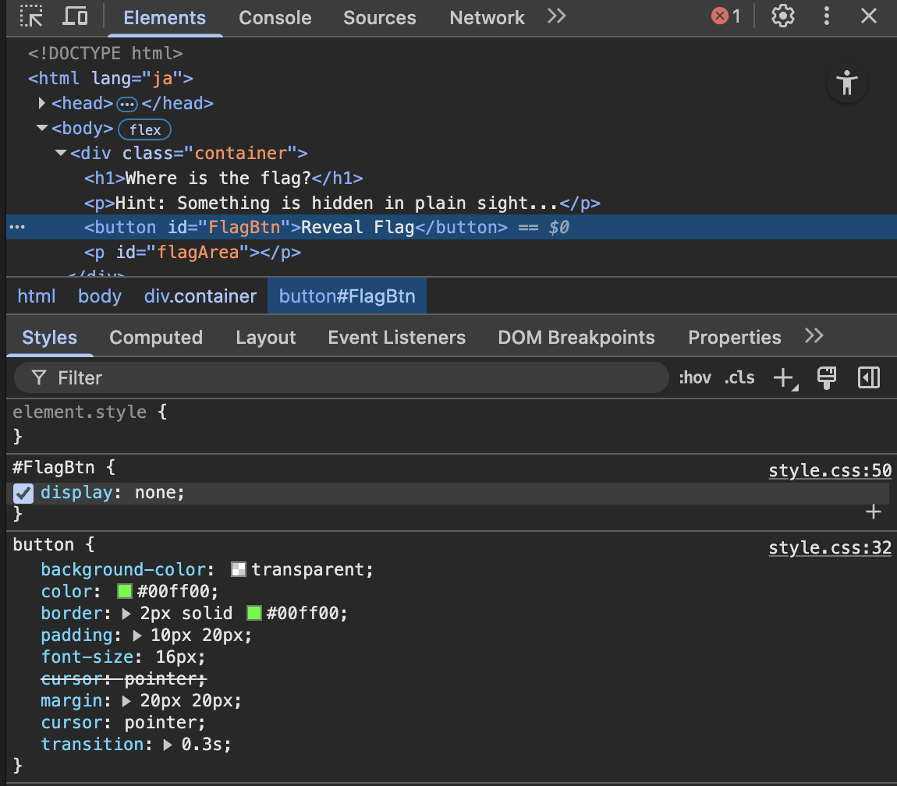

# Hidden Button

## 解説

### Flagを表示するボタンが、画面上で表示されない

### 実際の用途

display:none はレイアウトから完全に消すためのCSS

例:
1. モーダル（ポップアップ画面）
2. ローディング画面
3. レスポンシブ対応
   など

> display:none はよく使われるが、セキュリティ機能ではないため、機密情報を隠すために使用することは非推奨

## 解法

`F12` または `ctrl+shift+I`で開発者ツールを開き、

1. `body`の中にある`container`を展開
2. `FlagBtn`を選択し、`dispaly:none`のチェックを外す

3. 表示された`FlagBtn`をクリックし、Flagを表示
